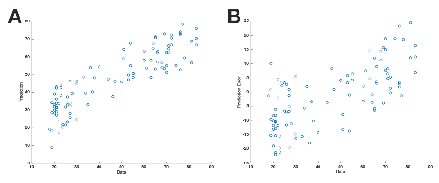

Prism: Multiple spline regression with regularization, dimensionality reduction, and feature selection
====

# Summary
Prism uses a combination of statistical methods to conduct spline-based multiple regression. Prism conducts this regression using regularization, dimensionality reduction, and feature selection, through a combination of smoothing spline regression, PCA, and RVR/LASSO. 

Figure 1: Illustration of Prism regression procedure, first conducting spline regression for each predictor, followed by dimensionality reduction and feature selection (panel A). The logo for Prism is shown in panel B.


Prism has been tested in MATLAB 2015b and requires three first-party toolboxes: (1) Curve Fitting Toolbox; (2) Statistics and Machine Learning Toolbox; (3) Signal Processing Toolbox. Relevance Vector Regression (RVR) requires the SparseBayes V2 toolbox, which can be obtained from http://www.relevancevector.com.

# Citing the toolbox

Please cite this paper if you use the toolbox:

Madan, C. R. (under review). Prism: Multiple spline regression with regularization, dimensionality reduction, and feature selection. 

# Usage

See `demo.m` for an outline of the implementation.

```matlab
% Demo of Prism functionality
% 20160627 CRM

%% init
% import prism
addpath(fullfile('..','prism'))

% load demo data
load('demo')
% demo contains four variables:
%
% tr_X and tr_y are our training data
% te_X and te_y are our test data
%
% tr data has 500 cases, te data has 100 cases
% X has 175 predictors

%% Train

% clear opt, in case it has any previous values
clear opt
% some warnings 'commonly' occur
%       I don't want disabling these to be the default
%       but, also are not a problem in most cases 
%       (won't be best model anyway)
% so let's disable them with the options
opt.disableWarnings = 1;

% force least-squares spline, often reduces over-fitting
opt.spline.p        = 0;

% options to experiment with:
%opt.doSpline        = 0;
%opt.doPCA           = 0;
%opt.doRVR           = 0;

% fit prism to training data
mdl     = prism_train(tr_X,tr_y,opt);
% get performance metrics
% is an estimate of best-case of sorts:
%       poor performance here is a bad sign
%       but, good performance could represent over-fitting
tr_perf = prism_eval(tr_y,mdl)

% results with spline.p=0
% mdl performance (tr_perf) should be approx:
%       r2 = .77; MdAE = 6.40

%% Test

% apply model from training data to test data
% mdl.pred here is y_hat
fit     = prism_test(te_X,mdl);
% measure model performance, i.e., the whole point of this
te_perf = prism_eval(te_y,fit)

% fit performance (te_perf) should be approx:
%       r2 = .78; MdAE = 7.75

% visualize predictions in test data
% Fig A. Data vs. Prediction
figure; scatter(te_y,fit.pred); xlabel('Data'); ylabel('Prediction');
% Fig B. Data vs. Prediction Error
figure; scatter(te_y,te_y-fit.pred); xlabel('Data'); ylabel('Prediction Error');

```

Figure 2: Output scatter plots for code in `demo.m`.




```
function mdl = prism_train(tr_X,tr_y,opt)
% Build multiple regression model from training data.
%
% Inputs:
%   tr_X    = X data to train on
%             each column is considered as an indepdent predictor
%             should be size NxM
%   tr_y    = Y data to train on
%             should be size Nx1
%
%   opt     = set options for multiple regression model
%
%              .doSpline        = enables/disables the spline regression
%                                 (default: 1)
%              .doPCA           = enable/disable the PCA (default: 1)
%              .doRVR           = use RVR (default: 1), or LASSO (0)
%
%              .spline.p        = smoothing parameter to use in spline
%                                 regression
%                                 if not specified, will be selected by csaps
%                                 if is a vector, must be length M, where
%                                 each index will be used for the
%                                 respective column in X
%                                 if is a single value, will use it for all
%                                   0 results in least-squares cubic spline
%                                   1 results in variational/'natural'
%                                     cubic spline interpolant
%                                 See 'csaps' for further details.
%                                 default: [ 10:10:90 100:100:1000 Inf ]
%              .pc.thresh       = Threshold for number of principle
%                                 components to keep, based on miniumum
%                                 amount of explained variance, as a
%                                 percent (default: 95)
%              .lasso.k         = Set 'l' for LASSO k-fold CV (default: 10)
%
%              .disableWarnings = disable common warnings (default: 0)
%
%
% Outputs:
%   mdl     = fitted Prism model given training data
%             struct with two subfields:
%               .stats 			= model parameters for spline, pca, rvr/lasso
%               .pred  			= predicted y (i.e., y_hat)
%               .opt   			= store options underlying model
%
% Matlab toolbox dependencies: stats, curvefit, signal
% For RVR, also requires SparseBayes V2 (http://www.relevancevector.com).
%
% 20160621 CRM
```

```
function fit = prism_test(te_X,params)
% Apply previous model to test data.
%
% Inputs:
%   te_X    = X data to test with
%             should be same organization as tr_X
%   params  = output from prism_train
%             prefers mdl.stats
%                also accepts the 'mdl' model output itself,
%                for convienence
% Outputs:
%   fit     = output after applying Prism to training data
%             struct with one subfield:
%               .pred  = predicted y (i.e., y_hat)
%
% 20160621 CRM
```

```
function perf = prism_eval(y,pred)
% Calculate basic performance for Prism model.
% 
% Inputs:
%   y       = 'y' from model (i.e., dependent variable)
%   pred    = pred field from prism_train/test
%                 also accepts the 'mdl' model output itself,
%                 for convienence
%
% Outputs:
%   perf    = struct with three fields:
%              .r2   = r^2, explained variance
%              .mae  = mean absolute error
%              .mdae = median absolute error
%              .rmsd = root mean squared deviation
%
% 20160619 CRM
```

# License
Matlab code is made available under an BSD license (see `LICENSE`).

```
Copyright (c) 2016, Christopher R. Madan.
All rights reserved.

Redistribution and use in source and binary forms, with or without
modification, are permitted provided that the following conditions are met:

* Redistributions of source code must retain the above copyright notice, this
  list of conditions and the following disclaimer.

* Redistributions in binary form must reproduce the above copyright notice,
  this list of conditions and the following disclaimer in the documentation
  and/or other materials provided with the distribution.

THIS SOFTWARE IS PROVIDED BY THE COPYRIGHT HOLDERS AND CONTRIBUTORS "AS IS"
AND ANY EXPRESS OR IMPLIED WARRANTIES, INCLUDING, BUT NOT LIMITED TO, THE
IMPLIED WARRANTIES OF MERCHANTABILITY AND FITNESS FOR A PARTICULAR PURPOSE ARE
DISCLAIMED. IN NO EVENT SHALL THE COPYRIGHT HOLDER OR CONTRIBUTORS BE LIABLE
FOR ANY DIRECT, INDIRECT, INCIDENTAL, SPECIAL, EXEMPLARY, OR CONSEQUENTIAL
DAMAGES (INCLUDING, BUT NOT LIMITED TO, PROCUREMENT OF SUBSTITUTE GOODS OR
SERVICES; LOSS OF USE, DATA, OR PROFITS; OR BUSINESS INTERRUPTION) HOWEVER
CAUSED AND ON ANY THEORY OF LIABILITY, WHETHER IN CONTRACT, STRICT LIABILITY,
OR TORT (INCLUDING NEGLIGENCE OR OTHERWISE) ARISING IN ANY WAY OUT OF THE USE
OF THIS SOFTWARE, EVEN IF ADVISED OF THE POSSIBILITY OF SUCH DAMAGE.
```

# Example implementation

To provide an example of Prism's implementation, see the 'demo' folder. `demo.mat` was generated using brain morphology data, where each column corresponds to a brain morphology measure. The test and training data are derived from independent MR sites, and the dependent variable is age. The data is from an unpublished study and the pre-processing pipeline is not finalized (e.g., correcting for site effects), so further information of the dataset is not provided at this time.

# Benchmark

As a benchmark, `demo.m` was run using several configurations: (1) RVR (default) or LASSO for the multiple regression; (2) with or without PCA; and (3) with or without spline regression--yielding eight comparison analyses. A 'constant' model, where all ages are simply predicted to be the mean age (within the testing dataset) was also included as an upper-limit of performance (i.e., a good model should do no worse than this).

Here I ran each analyses 100 times and report several measures of performance: R<sup>2</sup> and median absolute error (MdAE) in the testing data, average time to compute (all run on the same machine), and stability of error performance (SD of MdAE across the 100 calculations). All analyses were run with least-squares splines (`opt.spline.p=0`).


Model variant              |  R<sup>2</sup>  |  MdAE  | Time [s] | SD(MdAE)
-------------------------- | ----: | -----: | -------: | -------:
Spline+PCA+RVR             |  .777 |  7.74  |    0.55  |   0    
(Prism default)            |       |        |          |         
                           |       |        |          |
Spline+PCA+LASSO           |  .779 |  8.06  |    3.84  |   0.17      
Spline+RVR                 |  .758 |  8.42  |    1.26  |   0      
Spline+LASSO               |  .776 |  8.35  |  232.84  |   0.05      
PCA+RVR                    |  .601 | 12.31  |    0.12  |   0      
PCA+LASSO                  |  .713 |  9.66  |    2.54  |   0.11      
RVR                        |  .703 | 10.57  |    0.12  |   0      
LASSO                      |  .777 |  8.53  |  231.43  |   0.04
                           |       |        |          |
Constant [y_hat = Mean(y)] |  .000 | 22.28  |          |


The above benchmarks suggest that, given the `demo.mat` training and test data, spline-based regression leads to substantially better predictions, particularly in the case of the median absolute error (MdAE). When splines are not used, LASSO performs better than RVR, but comes with a much larger computational cost. This computational cost can be largely mitigated through the use of PCA for dimensionality reduction, but even otherwise, PCA is associated with a marked improvement in prediction performance. We also see that given this dataset, regression models using LASSO (as opposed to RVR), are nondeterministic (i.e., there is variability in the performance of the model across each time it is run ), as SD(MdAE)>0.

